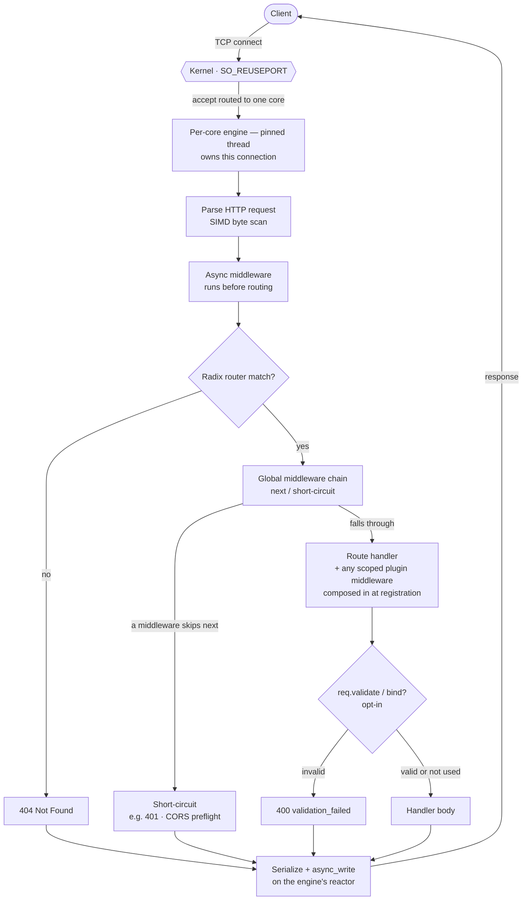
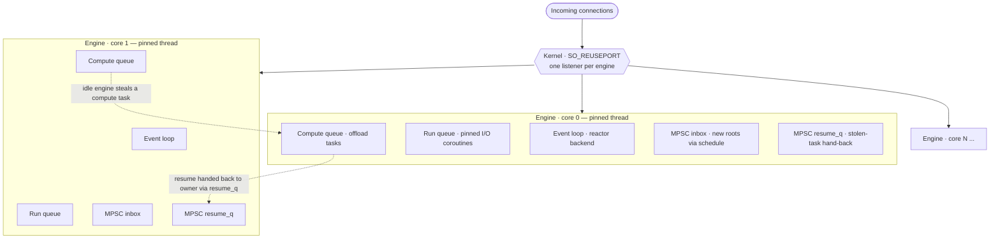

# SwiftNet

> ### ⚡ Build fast HTTP APIs in modern C++.

SwiftNet is a C++23 coroutine web framework with an
Express/Fastify-style API, built on a **per-core, shared-nothing, lock-free** runtime. Each CPU core runs one engine that owns its own
connections, run queue, and I/O reactor — no global queues, no shared mutable state on the request
hot path. The best I/O backend, SIMD path, and core-pinning for the machine are **auto-detected and
embedded** (not knobs); everything that depends on your workload or deployment is a documented knob.

> **Honesty note.** Performance is measured only on the hardware the authors can run: **Apple Silicon
> (M1 Pro, arm64) with the kqueue backend.** The Linux (io_uring/epoll) and Windows (IOCP) backends are
> implemented and functionally tested but **UNVERIFIED for throughput** — no speed is claimed for them.
> [BENCHMARKS.md](BENCHMARKS.md) is the single source of truth for numbers and methodology.

---

## Install

Requires a C++23 compiler (Clang ≥ 17 / GCC ≥ 13; tested on Apple Clang 21) and CMake ≥ 3.20.
Dependencies are fetched/vendored automatically: nlohmann/json + Glaze (JSON), spdlog (logging),
rapidyaml (config, vendored), doctest (tests), and liburing on Linux if present.

```bash
cmake -S . -B build -DCMAKE_BUILD_TYPE=Release
cmake --build build -j
ctest --test-dir build --output-on-failure
```

On Apple Silicon, also pass `-DCMAKE_OSX_ARCHITECTURES=arm64 -DCMAKE_OSX_SYSROOT="$(xcrun --show-sdk-path)"`.

To use it from your own CMake project, add this repo via `add_subdirectory()` (or FetchContent) and
link `swiftnet`.

---

## Hello, world

Full source: [examples/hello.cpp](examples/hello.cpp) (built in CI as the `hello` target).

```cpp
#include "swiftnet.hpp"
using namespace swiftnet;

int main() {
    SwiftNet app(8080);
    app.get("/", [](Request&, Response& res) { res.text("Hello, World!"); });
    app.get("/json", [](Request&, Response& res) {
        Json j; j["message"] = "Hello, World!";
        res.json(j);                 // dynamic JSON (nlohmann)
    });
    app.listen([]{ /* listening on :8080 */ });
    return 0;
}
```

## Typed JSON (Fastify/FastAPI/Spring-style)

Define a plain struct — **Glaze** reflects it at compile time (no schema, no macros) and
(de)serializes at native speed on the hot path. Full source:
[examples/typed_json.cpp](examples/typed_json.cpp) (`typed_json` target).

```cpp
struct User { int id{}; std::string name; bool active{}; };

app.get("/users/sample", [](Request&, Response& res) {
    res.json(User{1, "ada", true});          // typed serialize (Glaze)
});

app.post("/users", [](Request& req, Response& res) {
    User u = req.body<User>();               // typed parse (Glaze); default-constructed on bad input
    if (u.name.empty()) { res.bad_request("name is required"); return; }
    res.status(201).json(u);
});
```

`Json` (nlohmann) is still there for dynamic documents — `res.json(Json{...})` and `req.json()`. The
typed `json<T>` overload is constrained so it never competes with the dynamic one or with `text()`.

## Request validation (schema constraints)

`req.body<T>()` gives you *shape/type* correctness. For *constraint* validation (required, ranges,
length, regex, enum — the Ajv-style rules) declare a `swiftnet::schema<T>` with constraints keyed by
member pointer. Field names are derived at compile time from the member pointer (via Glaze), so you
never repeat them. It is **opt-in** — a type with no `schema<T>` validates as ok, and routes that
don't call `validate`/`bind` are on the unchanged hot path.

```cpp
#include "schema.hpp"
// `Signup` here is its own illustrative type — unrelated to the `User` in the typed-JSON section above.
struct Signup { std::string name; int age{}; std::string email; std::string role;
                std::optional<std::string> nickname; };

template <> struct swiftnet::schema<Signup> {
    static constexpr auto rules = swiftnet::rules(
        swiftnet::field<&Signup::name>(len(1, 50)),                   // non-optional: required{} would be a no-op
        swiftnet::field<&Signup::age>(range(0, 150)),
        swiftnet::field<&Signup::email>(pattern("^[^@]+@[^@]+$")),
        swiftnet::field<&Signup::role>(one_of("admin", "user", "guest")),
        swiftnet::field<&Signup::nickname>(required{}, max_len(20))); // std::optional<T> — required{} works here
};

app.post("/signup", [](Request& req, Response& res) {
    auto s = req.bind<Signup>(res);   // parse + validate; on failure writes 400 JSON, returns nullopt
    if (!s) return;                   // one-liner happy path
    // ... use *s ...
    res.status(201).json(*s);
});
// or, for custom handling:  auto v = req.validate<Signup>();  // -> { bool ok; Signup value; vector<FieldError> errors }
```

Constraints (a wrong-type use is a clear **compile error**, e.g. `len` on a numeric field):

| Rule | Applies to | Example |
|---|---|---|
| `required{}` | `std::optional<T>` members (fails if absent; no-op on non-optional) | `field<&U::nick>(required{})` |
| `min(v)` / `max(v)` / `range(lo,hi)` | numeric | `field<&U::age>(range(0,150))` |
| `min_len(n)` / `max_len(n)` / `len(lo,hi)` | string | `field<&U::name>(len(1,50))` |
| `pattern("regex")` | string (std::regex; compiled once, thread-local cache) | `field<&U::email>(pattern("^[^@]+@[^@]+$"))` |
| `one_of(a,b,…)` | string or numeric | `field<&U::role>(one_of("admin","user"))` |

> ⚠️ **`required` only works on `std::optional<T>` fields.** Presence is detected by whether the
> optional is engaged after parsing. On a **non-optional** field `required{}` is a **silent no-op** —
> a parsed struct always has every non-optional member (defaulted if the JSON key was absent), so
> "missing" and "default value" are indistinguishable without re-parsing the raw JSON (which SwiftNet
> deliberately does not do). **To make a field mandatory, declare it `std::optional<T>` and add
> `required{}`.**

On failure `bind<T>()` responds **400** with all violations collected:

```json
{"error":"validation_failed",
 "details":[{"field":"age","rule":"range","message":"age must be in [0, 150]"},
            {"field":"email","rule":"pattern","message":"email does not match required pattern"}]}
```

## Plugins & encapsulation (Fastify-style)

Group related routes behind a prefix, give them their own middleware, and share typed state — all
*encapsulated* so siblings can't see each other. `app.plugin(fn, {prefix})` hands your function a
`Scope` to register on:

```cpp
#include "scope.hpp"

app.use(corsMiddleware);                              // root/global: applies to ALL routes

app.plugin([](swiftnet::Scope& v1) {
    v1.decorate<std::shared_ptr<Db>>("db", openDb()); // scoped typed state
    v1.use(requireAuth);                              // scoped middleware: /v1/* only

    auto db = v1.get<std::shared_ptr<Db>>("db");      // read at registration, capture into handlers
    v1.get("/users", [db](Request&, Response& res) { res.text((*db)->query()); }); // -> /v1/users

    v1.plugin([](swiftnet::Scope& admin) {            // nested child scope
        admin.use(requireAdmin);                      // /v1/admin/* runs requireAuth THEN requireAdmin
        admin.decorate<std::shared_ptr<Db>>("db", openAdminDb()); // overrides the parent's "db"
        admin.get("/stats", /* ... */);               // -> /v1/admin/stats
    }, {.prefix = "/admin"});
}, {.prefix = "/v1"});

app.plugin([](swiftnet::Scope& v2) {
    auto db = v2.get<std::shared_ptr<Db>>("db");      // == nullptr: a sibling can't see /v1's "db"
    v2.get("/ping", /* ... */);                       // -> /v2/ping, no auth (v2 added none)
}, {.prefix = "/v2"});
```

| Concept | Verb | Encapsulation rule |
|---|---|---|
| Scoped routes | `s.get/post/put/del/patch/options/head(path, h)` | registered at `prefix + path` in the global radix router |
| Scoped middleware | `s.use(mw)` | runs for this scope's routes **and its children**, in `root → … → this` order; never for siblings/parents |
| Typed decorators | `s.decorate<T>("k", v)` / `s.get<T>("k")` | a child **inherits** parent decorators, may **override** locally; **siblings are isolated** |
| Nested plugin | `s.plugin(fn, {prefix})` | a child scope; prefixes compose (`/v1` + `/admin` → `/v1/admin`) |

**Zero per-request overhead.** A route's scoped middleware chain is resolved and composed into its
handler **at registration**, then stored in the same router every other route uses — the per-request
hot path (routing, dispatch) is unchanged, and routes outside a scope are untouched. Global `app.use`
middleware still runs outermost (it wraps scoped middleware). A prefix-only plugin with no middleware
is byte-for-byte identical to a hand-registered route.

> ⚠️ **Decorators are read-only after registration.** `get<T>("k")` returns
> `std::shared_ptr<const T>`, so a handler that captures a decorator cannot mutate shared state across
> engines (preserving the lock-free, no-shared-mutable-state model). A `get<T>` for a missing key — or
> one stored under a *different* type — returns `nullptr` (a safe miss, never UB; debug builds log it).
> Read decorators at registration and **capture them into your handler closures** (as above); that is
> the access path, and it keeps lookups off the hot path. Call `plugin()` **before** `listen()`.

## Async handlers and CPU offload

Handlers may be coroutines that `co_await` async I/O. For CPU-heavy work, `co_await
swiftnet::offload(fn)` moves it to a **stealable compute task** so it doesn't block the engine's
I/O-bound connections (see the [work-stealing valve](#work-stealing-valve)):

```cpp
app.get("/work", [](Request&, Response& res) -> vthread {
    std::uint64_t sum = 0;
    co_await swiftnet::offload([&sum]{                  // runs on a stealable compute task
        for (std::uint64_t i = 0; i < 1'000'000; ++i) sum += i;
    });
    Json j; j["sum"] = sum;                             // sum was produced by the offloaded work
    res.json(j);
    co_return;
});
```

---

## Request lifecycle

A request never leaves the core that accepted it — the whole path below runs on one pinned engine
thread, lock-free. Only the **route handler** is yours to write; everything else is the framework.



Scoped plugin middleware is **composed into the handler at registration**, so it costs nothing extra
at request time, and `req.validate` / `req.bind` run only if your handler calls them.

---

## Architecture: per-core, shared-nothing, lock-free

This is **how SwiftNet works**, not a mode you select — there is no shared global-queue scheduler and
no toggle for one.

- **One engine per core.** Each engine is a pinned thread that fuses the I/O reactor with the worker:
  it owns its own event loop, its own run queue, and the connections it accepts.
- **Kernel connection sharding via `SO_REUSEPORT`** — every engine has its own listener, so accepts
  spread across cores with no shared accept lock.
- **Connections are pinned.** A connection's coroutine, its fds, and its pending I/O all live on the
  engine that accepted it and always resume there, so the per-request path takes **no locks**.
- **Cross-thread work** (e.g. `schedule()` from another thread) is injected through a lock-free MPSC
  inbox and drained by the owning engine.
- **I/O coroutines are never stolen.** Only explicit compute tasks (`offload`) are stealable — moving a
  pinned I/O coroutine would arm the wrong engine's reactor.



Every engine is identical and shares nothing on the request path. Connections — and their I/O
coroutines — are pinned to the engine that accepted them. The **work-stealing valve** is OFF by
default; when on, an idle engine may take a *compute* task (from `offload`) off a busy one — never a
pinned I/O coroutine — and the original connection still resumes on its owner engine.

Routing uses a compiled **radix tree** (static / `:param` / `*`), not per-request regex.

---

## Auto-detection (embedded, not overridable)

At startup SwiftNet detects the OS, kernel, CPU arch, core topology, and available kernel/CPU features,
then **embeds the universally-best choice** for that machine and logs it. These are not knobs —
exposing them would only invite misconfiguration. Detection **fails safe** to the most portable correct
option.

| Machine class | I/O backend | SIMD | Core pinning |
|---|---|---|---|
| Linux, io_uring probe OK (kernel + liburing + not sandboxed) | **io_uring** | NEON (arm64) / AVX2·SSE2 (x86) | yes (if permitted) |
| Linux, io_uring probe fails (old kernel / seccomp / container) | **epoll** | NEON / AVX2·SSE2 | yes (if permitted) |
| macOS (Apple Silicon / Intel) | **kqueue** | NEON / AVX2·SSE2 | **no** — `KERN_NOT_SUPPORTED` (never faked) |
| Windows | **IOCP** | AVX2·SSE2 | yes |
| anything inconclusive | **epoll** | scalar | no |

The io_uring choice comes from an **actual `io_uring_queue_init` probe**, not a version guess, so a
container whose seccomp policy blocks io_uring transparently falls back to epoll. (The probe is
compiled in only when liburing is found at build time; without it, io_uring reports unavailable and
epoll is selected. On x86, AVX2 is preferred over SSE2; on ARM, NEON is the baseline.) The selected
backend is logged at startup with a `VERIFIED`/`UNVERIFIED` tag, e.g.:

```
SwiftNet runtime: os=macOS (25.5.0) arch=arm64 cores=10 logical/10 physical
  topology: P-cores=8 E-cores=2
  backend: kqueue [VERIFIED]   simd: NEON
  pinning: DISABLED (macOS: KERN_NOT_SUPPORTED)
SwiftNet config: engines=10 port=8080 backlog=1024
  valve: OFF (threshold=1 max_batch=1 min_idle=0)   limits: max_header=65536B max_body=8388608B  log_level=info
```

---

## Configuration

Precedence, lowest to highest: **built-in defaults → programmatic (code) → YAML file → environment
variables** — **environment always wins.** The *programmatic* layer covers only the three values you
set in code (port, engines, backlog; see below); every other knob comes from defaults, YAML, or env.
YAML is optional (path from `SWIFTNET_CONFIG`, else `./swiftnet.yaml`); a missing file is skipped and a
malformed one is logged and ignored (never crashes).

| Knob | Env var | YAML key | Default | Range | Platform |
|---|---|---|---|---|---|
| Engine count | `SWIFTNET_ENGINES` | `engines` | all logical cores | 1..logical | all |
| Listen port | `SWIFTNET_PORT` | `port` | 8080 | 1..65535 | all |
| Accept backlog | `SWIFTNET_BACKLOG` | `backlog` | 1024 | 1..1048576 | all |
| Work-steal valve | `SWIFTNET_STEAL` | `steal` | off | 0/1 | all |
| Steal threshold (victim depth) | `SWIFTNET_STEAL_THRESHOLD` | `steal_threshold` | 1 | 0..1048576 | all |
| Steal max batch / turn | `SWIFTNET_STEAL_MAX_BATCH` | `steal_max_batch` | 1 | 1..65536 | all |
| Min idle engines before stealing | `SWIFTNET_STEAL_MIN_IDLE` | `steal_min_idle` | 0 | 0..engines | all |
| Max request header bytes | `SWIFTNET_MAX_HEADER_BYTES` | `max_header_bytes` | 65536 (64 KiB) | 1024..1048576 (1 KiB–1 MiB) | all |
| Max request body bytes | `SWIFTNET_MAX_BODY_BYTES` | `max_body_bytes` | 8388608 (8 MiB) | 0..2147483648 (0–2 GiB) | all |
| Log level | `SWIFTNET_LOG_LEVEL` | `log_level` | info | trace/debug/info/warn/error | all |
| io_uring provided buffers | `SWIFTNET_IOURING_PROVIDED_BUFFERS` | `iouring_provided_buffers` | off | 0/1 | Linux (reserved, UNVERIFIED) |
| I/O backend · SIMD · pinning | — | — | **auto-detected** | — | embedded (logged, not overridable) |

Example `swiftnet.yaml`:

```yaml
engines: 8
port: 8080
backlog: 1024
steal: false
steal_threshold: 2
max_body_bytes: 1048576
log_level: info
```

Programmatic seeds — port, engines, backlog — overridden by YAML/env:
`SwiftNet app(port); app.set_threads(n); app.set_backlog(b);`

---

## Work-stealing valve

Off by default. The per-core model wins on cache locality under balanced load, but under **imbalance**
(one engine buried in CPU-heavy `offload` work while others sit idle) that advantage erodes — so the
valve lets an idle engine **steal a compute task** off a busy one. It is **compute-only**; pinned I/O
is never moved. Knobs: `steal` (on/off), `steal_threshold` (victim depth before stealing),
`steal_max_batch` (tasks run per engine turn), `steal_min_idle` (idle engines required before
stealing). Honest framing: the valve **redistributes spare capacity, it does not create it** — its
benefit shrinks as all cores get busy. Measured OFF/ON/INLINE deltas are in
[BENCHMARKS.md §4](BENCHMARKS.md) (it relieves light-connection tail latency dramatically *given*
offload; it cannot help work that runs inline in a pinned coroutine).

---

## Verified vs unverified (per platform/backend)

| Platform / backend | Status | What's verified |
|---|---|---|
| **macOS / kqueue** (Apple Silicon) | ✅ **Measured** | All BENCHMARKS.md numbers; ctest; ThreadSanitizer-clean under load |
| **Linux / io_uring** | ⚙️ Functional, **throughput UNVERIFIED** | Compiles + full test suite + live requests in a Linux container; per-engine timers + eventfd wake + `COOP_TASKRUN` (intentionally not `SINGLE_ISSUER`/`DEFER_TASKRUN` — the ring is created off the engine thread, so those flags would abort). Multishot accept / provided buffers are documented future work |
| **Linux / epoll** | ⚙️ Functional, **throughput UNVERIFIED** | Auto-selected when io_uring is unavailable; compiles + test suite + live requests in a container |
| **Windows / IOCP** | 🚧 **Skeleton, UNVERIFIED** | Compiles as a shape behind the backend interface; a real `OVERLAPPED` + `WSARecv/WSASend` completion path (and the Windows `tcp_socket` integration) is **not yet done** — the authors have no Windows toolchain to compile or run it |

No throughput/latency number is reported for any backend except kqueue. See
[BENCHMARKS.md](BENCHMARKS.md).

---

## Building & testing

```bash
# Release (default)
cmake -S . -B build -DCMAKE_BUILD_TYPE=Release && cmake --build build -j
ctest --test-dir build --output-on-failure          # unit, detect, config, simd, glaze, validate, plugin, integration

# Sanitizers (gate the concurrency-critical paths)
cmake -S . -B build-tsan -DSWIFTNET_SANITIZE=thread  && cmake --build build-tsan -j
cmake -S . -B build-asan -DSWIFTNET_SANITIZE=address && cmake --build build-asan -j
```

CMake options: `SWIFTNET_NATIVE` (host-CPU tuning, default ON — auto-skipped if the toolchain rejects
it), `SWIFTNET_LTO` (default OFF), `SWIFTNET_SANITIZE` (`none|address|thread|undefined`),
`SWIFTNET_BUILD_EXAMPLES`, `SWIFTNET_BUILD_TESTS`.

Benchmark harness and the off-host load-generator kit live in [benchmark/](benchmark/); the Linux
io_uring/epoll functional check runs in Docker (see [BENCHMARKS.md](BENCHMARKS.md) → Reproduce).
