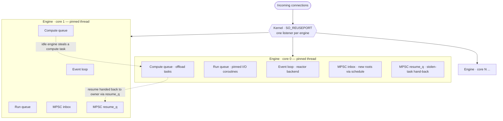

# Architecture overview

SwiftNet runs on a per-core, shared-nothing, lock-free runtime: each CPU core owns one engine, and a request never leaves the core that accepted it. This page explains that model so the rest of the docs make sense.

> This is **how SwiftNet works**, not a mode you select. There is no shared global-queue scheduler and no toggle to switch to one. Everything below is always on.

## The one-line model

One **engine** per core. An engine is a pinned thread that fuses the I/O reactor with the worker — it owns its own event loop, its own run queue, and the connections it accepts. Engines are identical and share nothing on the request hot path.

## How it works

- **One engine per core.** At startup SwiftNet creates one engine per resolved core (see `set_threads` / the `SWIFTNET_ENGINES` knob in [auto-detection.md](auto-detection.md)). Each engine is a thread with its own `event_loop`, run queue, and compute queue.
- **Pinned threads where the OS allows it.** An engine pins itself to its core when the platform supports CPU affinity. On macOS pinning is always disabled (`KERN_NOT_SUPPORTED`); the engine still owns its core's work, it just isn't hard-bound to a physical core. SwiftNet never fakes pinning — the chosen behavior is logged at startup.
- **Kernel connection sharding via `SO_REUSEPORT`.** Every engine opens its *own* listener socket on the same port with `SO_REUSEPORT`. The kernel spreads incoming connections across those listeners, so there is no shared accept lock and no single thread funneling accepts.
- **Connections are pinned to their accepting engine.** A connection's coroutine, its file descriptors, and its pending I/O all live on the engine that accepted it, and they always resume there. Because nothing about a connection is shared with another engine, the per-request path takes **no locks**.
- **Cross-thread work goes through a lock-free MPSC inbox.** When another thread hands work to an engine (for example via `schedule()`), the work is pushed onto that engine's lock-free multi-producer/single-consumer inbox and drained by the owning engine on its next turn. The owner is the only consumer, so no lock is needed on the hot path.
- **I/O coroutines are never stolen.** Only explicit `offload` compute tasks are stealable. Moving a pinned I/O coroutine to another engine would arm the wrong engine's reactor, so SwiftNet never does it — even when the optional [work-stealing valve](work-stealing-valve.md) is on, the stolen item is always a compute task. When a thief finishes a stolen task it hands the connection back through the owning engine's lock-free `resume_q` (then wakes it), so the connection always resumes where its I/O is pinned — a thief never writes another engine's run queue.

## What lives on each engine

| Per-engine resource | What it holds | Shared across engines? |
|---|---|---|
| Event loop / reactor | The auto-detected I/O backend (kqueue, io_uring, epoll, IOCP) | No |
| Listener socket | Its own `SO_REUSEPORT` listener on the configured port | No (kernel shards across them) |
| Run queue | Pinned I/O coroutines for connections this engine accepted | No |
| Compute queue | `offload` tasks; the only thing the valve may move between engines | Drained by owner; valve may steal |
| MPSC inbox | Cross-thread `schedule()` injections of new roots, drained by the owner | Many producers, one consumer |
| MPSC resume_q | Connections handed back by a thief after a stolen compute task; drained and resumed by the owner | Many producers, one consumer |

## Why this design

- **No locks on the request path.** A request is accepted, parsed, routed, handled, and written all on the same engine, touching only that engine's data. There is no global run queue to contend on and no shared mutable state on the hot path.
- **Cache locality.** A connection's buffers, coroutine frame, and reactor state stay on one core, so they stay warm in that core's caches across the request's suspend/resume points.
- **Predictable scaling.** Because engines are identical and independent, adding cores adds independent capacity rather than more contention.

> The trade-off: under heavy *imbalance* — one engine buried in CPU-heavy `offload` work while others sit idle — strict pinning can leave spare cores unused. The optional [work-stealing valve](work-stealing-valve.md) addresses exactly that case for compute tasks, and only for compute tasks. It is off by default.

## Common pitfalls

- **Don't share mutable state across engines.** Two requests for the same route may run on different engines simultaneously with no lock between them. Use per-engine state, immutable shared data, or read-only plugin decorators (`Scope::decorate` / `Scope::get` return `std::shared_ptr<const T>`).
- **Don't expect `offload` to move the connection.** `co_await offload(fn)` moves only the CPU work; the connection's coroutine resumes back on its owning engine afterward. See [../guides/async-and-offload.md](../guides/async-and-offload.md).
- **Don't run blocking work inline in a handler.** Inline blocking stalls the engine and every connection pinned to it. The valve cannot help work that runs inline — only work routed through `offload` is stealable. See [../guides/async-and-offload.md](../guides/async-and-offload.md).
- **The number of engines is the number of cores, not a thread pool to grow per request.** Tune it with `set_threads` / `SWIFTNET_ENGINES`, not by spawning your own threads per connection.

## See also

- [Request lifecycle](request-lifecycle.md) — the step-by-step path a single request takes on one engine.
- [Auto-detection](auto-detection.md) — how the I/O backend, SIMD path, core count, and pinning are chosen and embedded.
- [Work-stealing valve](work-stealing-valve.md) — the optional, compute-only mechanism for rebalancing `offload` work.
- [Async and offload](../guides/async-and-offload.md) — writing coroutine handlers and moving CPU-heavy work off the engine.
