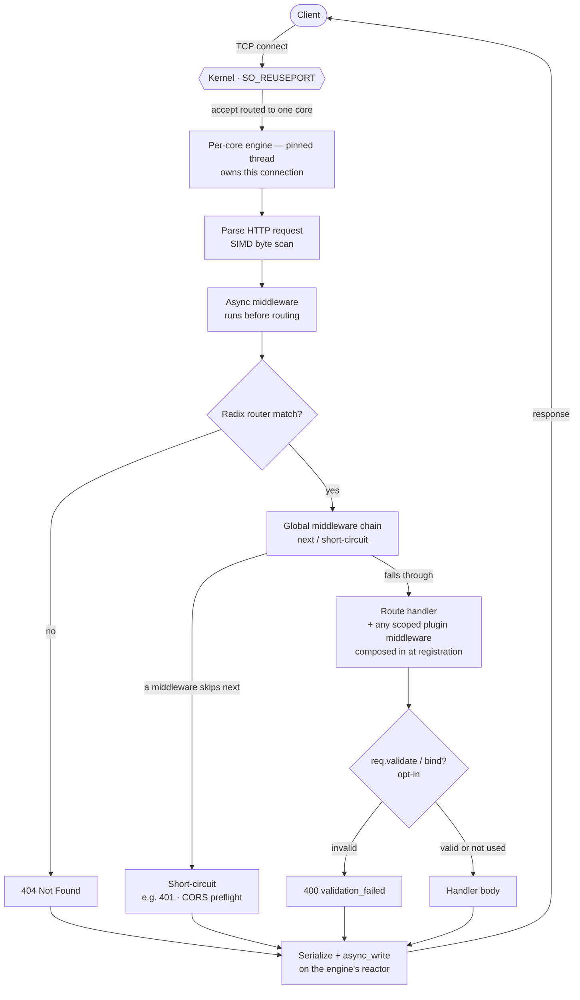

# Request lifecycle

This page traces a single HTTP request through SwiftNet, from the kernel handing the connection to one engine, to the bytes written back on the wire. Everything happens on one pinned engine: the request never hops cores, and the hot path takes no locks.

## Quick start

The whole lifecycle below is what runs for a handler this small. The framework does the accepting, parsing, routing, and serializing around it.

```cpp
#include <swiftnet.hpp>
using namespace swiftnet;

struct User { int id{}; std::string name; bool active{}; };

int main() {
    SwiftNet app(8080);

    app.use([](Request& req, Response& res, std::function<void()> next) {
        res.header("X-Request-Path", req.path()); // runs in the global chain
        next();                                    // call next() to continue
    });

    app.get("/users/:id", [](Request& req, Response& res) {
        User u{ std::stoi(req.param("id")), "Ada", true };
        res.json(u); // typed serialize (Glaze), Content-Type set for you
    });

    app.listen([] { /* server is up */ });
}
```

## How it works

A request flows through these steps, in this order. The order is taken directly from `server::client_task` (`src/http/http_server.cpp`) and `SwiftNet::handle_request_async` (`src/swiftnet.cpp`).



- **Kernel routes the accept to one engine.** Each engine has its own `SO_REUSEPORT` listener on the port (`src/vthread_scheduler.cpp`). The kernel picks which engine accepts a given connection, and that connection stays on that engine for its whole life. There is no shared accept queue and no cross-engine hand-off.
- **The engine reads and parses the bytes.** `client_task` reads into a per-connection buffer and calls `parse_request`, which uses a SIMD byte scan to find the header terminator and split the request line and headers (`detail::simd::find_double_crlf`, `find_crlf`, `find_char`). Incomplete requests just await more bytes; malformed ones get a best-effort `400` and the connection closes. The header map is **not** materialized here — `Request::header()` builds it lazily only if a handler asks.
- **Async middleware runs before routing.** Each `use_async` middleware is `co_await`ed in registration order. Any of them may suspend on async I/O, and any may short-circuit the request by calling `Response::end()` — if it does, the response is serialized immediately and no router lookup or handler runs.
- **The radix router matches the path (or 404).** The compiled radix router matches on `method()` and `path()` (query string already stripped, so `/q` matches `/q?name=ada`). On a match, route parameters like `:id` are filled in. On no match, the response becomes `404 Not Found` and the rest of the pipeline is skipped.
- **The global middleware chain runs.** Global `use(...)` middleware plus any prefix-matching path-scoped `use(prefix, ...)` middleware run via the shared `next()` chain (`detail::run_chain`). A middleware that calls `next()` continues the chain; one that returns without calling `next()` short-circuits, and the handler does not run.
- **The route handler runs.** If the chain reached the end, the handler is `co_await`ed. If it is a coroutine (`-> vthread`), its `co_await`s suspend the whole request on this engine and resume on the same engine. Any plugin/scope middleware was composed into this handler at registration time, so it runs here with no per-request lookup cost.
- **Validation runs only if the handler calls it.** `req.validate<T>()` or `req.bind<T>(res)` is opt-in. `bind` writes a `400` JSON body and returns `nullopt` on failure; if you never call them, no validation runs. See [Validation](../guides/validation.md).
- **The response is serialized and written on the engine reactor.** The `Response` is converted to wire bytes and written with `async_write` on the same engine's reactor. For keep-alive connections the loop continues for the next (possibly already-buffered, pipelined) request; otherwise the socket closes.

> Exceptions thrown from a handler are caught: the response is reset and replaced with `500 Internal Server Error`. The connection is not torn down by an uncaught exception in your handler.

## Lifecycle order reference

The exact sequence inside `handle_request_async`, with the short-circuit at each stage:

| Step | What runs | Source | Short-circuit / outcome |
| --- | --- | --- | --- |
| 1 | Accept on engine's `SO_REUSEPORT` listener | `vthread_scheduler.cpp` | Connection pinned to this engine |
| 2 | Read + SIMD parse | `parse_request`, `detail/simd.hpp` | `0` = need more bytes; `< 0` = `400` + close |
| 3 | Async middleware (`use_async`) | `handle_request_async` | `Response::end()` → serialize now, skip routing |
| 4 | Radix router match | `router_.match(...)` | No match → `404`, skip middleware + handler |
| 5 | Global + path middleware chain | `run_middlewares` / `run_chain` | Skipping `next()` → short-circuit, handler skipped |
| 6 | Route handler (+ composed scope middleware) | `co_await route_handler(...)` | Throw → caught, response becomes `500` |
| 7 | Optional `validate<T>` / `bind<T>` | `schema.hpp`, called by handler | `bind` failure → `400` JSON, returns `nullopt` |
| 8 | Serialize + write on reactor | `to_http_response()`, `async_write` | Keep-alive loops; `close` otherwise |

## Why it stays on one core

- One engine per logical core, each with its own reactor, its own `SO_REUSEPORT` listener, and engine-local run queues (`include/vthread_scheduler.hpp`).
- A connection is accepted by exactly one engine and every step above — parse, middleware, routing, handler, serialize, write — runs on that same engine. There is no cross-engine handoff and no shared mutable state on the hot path, so the path is lock-free.
- Coroutine `co_await`s (async middleware, async handlers, socket reads/writes) suspend and resume on the same engine; they do not migrate the request to another core.
- The one explicit exception is `co_await swiftnet::offload(...)`: it deliberately moves CPU-heavy work to a stealable compute task, then resumes your handler. Use it only for compute, not for the normal I/O path.

> ⚠️ Core pinning is platform-dependent. On macOS it is **always disabled** (`KERN_NOT_SUPPORTED`); the per-engine, one-connection-per-engine model still holds, but threads are not bound to specific cores. Pinning is enabled on Linux/Windows only when an affinity probe succeeds. The active choice is logged at startup with a VERIFIED/UNVERIFIED tag.

## Common pitfalls

- **Forgetting `next()` in middleware.** A synchronous middleware that does not call `next()` short-circuits the request — the router still ran, but neither later middleware nor the handler executes. This is intentional for auth/guards; it is a bug when accidental. See [Middleware](../guides/middleware.md).
- **Expecting validation to run automatically.** It does not. `req.body<T>()` never throws and returns a default-constructed `T` on bad input; validation only happens when you call `validate<T>()` or `bind<T>(res)`.
- **Reading headers when you do not need them.** The header map is built lazily on first `header()`/`headers()` call. Touching it in a hot handler forces that build — skip it on the fast path.
- **Assuming per-core means per-core-pinned on macOS.** The engine-per-core model is real, but pinning is off on macOS. Don't reason about cache locality as if threads are bound there.
- **Using `offload` for I/O.** `offload` is for CPU-bound work. Awaiting async I/O already stays on the engine; offloading I/O just adds a detour.

## Performance notes

The pinned, lock-free single-engine path is what keeps per-request latency and CPU-per-request low. The only measured backend is macOS/kqueue on Apple Silicon (M1 Pro), which is VERIFIED; Linux/io_uring and Linux/epoll are implemented and functionally tested but their throughput is UNVERIFIED, and Windows/IOCP is a skeleton (UNVERIFIED). For what is and isn't measured, and why single-host loopback numbers are not a web-throughput claim, see [Benchmarks](../benchmarks.md).

## See also

- [Overview](overview.md) — the architecture at a glance.
- [Routing](../guides/routing.md) — how the radix router matches paths and params.
- [Middleware](../guides/middleware.md) — global, path-scoped, and async middleware.
- [Validation](../guides/validation.md) — opt-in `validate<T>` / `bind<T>` and the 400 shape.
