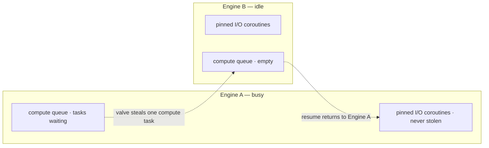

# The work-stealing valve

SwiftNet runs one engine per core, and each engine owns the connections it accepts. The work-stealing valve is an optional, off-by-default escape hatch that lets an idle engine pull a CPU-heavy `offload` task off a busy one when load goes lopsided.

> Off by default. With balanced traffic the per-core model already wins on cache locality, so leave the valve off unless your benchmarks show one engine starving the others on compute.

## Quick start

The valve only acts on work you explicitly hand to `offload`. Write the handler as a coroutine that offloads its CPU-heavy section, then turn the valve on via the environment.

```cpp
#include <swiftnet.hpp>
using namespace swiftnet;

int main() {
    SwiftNet app;

    // A coroutine handler: the CPU-heavy part runs as a stealable compute task,
    // then the connection resumes on its owner engine to write the response.
    app.get("/report", [](Request& req, Response& res) -> vthread {
        long sum = 0;
        co_await swiftnet::offload([&sum] {
            for (long i = 0; i < 50'000'000; ++i) sum += i; // CPU-heavy
        });
        res.json(Json{{"sum", sum}});
    });

    app.listen([] { /* ready */ });
}
```

```bash
# Turn the valve on for this run (environment always wins over YAML/code):
SWIFTNET_STEAL=1 ./your_server
```

> Work that runs *inline* inside a pinned coroutine is never stealable. The valve can only redistribute tasks you pass to `co_await swiftnet::offload(...)`. See [Async and offload](../guides/async-and-offload.md).

## How it works

- **Per-core baseline.** Each engine is a pinned thread fusing the I/O reactor with the worker; a connection's coroutine, its fds, and its pending I/O all live on the engine that accepted it. The per-request path takes no locks, which is exactly the cache-locality win the valve is trying not to spoil.
- **The imbalance case.** When one engine is buried in `offload` compute while peers sit idle, that locality advantage erodes. The valve lets an idle engine *steal* a queued compute task off the busy one instead of letting it pile up.
- **Compute-only.** Only explicit `offload` tasks are stealable. Pinned I/O coroutines are never moved — relocating one would arm the wrong engine's reactor.
- **Owner-resume.** The thief runs the stolen task's CPU work on its own core, then hands the coroutine resume back to the original owner engine (`owner->resume_q`), so the connection still resumes — and writes its response — on the engine that accepted it.
- **Owner-side queue discipline.** The owner pops its own tasks from the near end of its compute queue; a thief takes from the far end, reducing contention on the hot task.
- **Anti-starvation.** Even with the valve on, if an engine's own compute backlog grows past an internal cap (`kComputeBacklogCap`, currently 8) it runs its own task rather than waiting for a thief — so compute can never stall when every core is saturated.
- **Zero cost when off or idle.** With no local compute and no reason to steal, the engine never touches the compute mutex; `compute_depth` is a relaxed atomic checked on the hot path. The pure-I/O path (no `offload` anywhere) is unaffected.



## The four knobs

All four are configurable via environment variable or YAML (see [Configuration](../guides/configuration.md) for precedence — environment always wins). None has a programmatic setter.

| Knob | Env var | YAML key | Default | Range | Meaning |
|---|---|---|---|---|---|
| Valve on/off | `SWIFTNET_STEAL` | `steal` | `off` | `0`/`1` | Master switch. Off means no engine ever steals; each owner runs its own compute. |
| Steal threshold | `SWIFTNET_STEAL_THRESHOLD` | `steal_threshold` | `1` | `0..1048576` | A victim is only robbed when its compute queue depth is **strictly greater** than this. Higher = more conservative. |
| Steal max batch | `SWIFTNET_STEAL_MAX_BATCH` | `steal_max_batch` | `1` | `1..65536` | Maximum compute tasks an engine services per turn (own first, then a steal). |
| Min idle before steal | `SWIFTNET_STEAL_MIN_IDLE` | `steal_min_idle` | `0` | `0..engines` | A thief only steals when at least this many engines are currently idle. Raises the bar for spending spare capacity. |

```yaml
# swiftnet.yaml
steal: true
steal_threshold: 2
steal_max_batch: 1
steal_min_idle: 1
```

> Values are clamped on load: a negative `steal_threshold` becomes `0`, `steal_max_batch` below `1` becomes `1`, and a negative `steal_min_idle` becomes `0`.

## What it does and does not do

The valve **redistributes spare capacity; it does not create it.** When peers are idle, moving a compute task onto one of them relieves the busy engine's tail latency. As every core gets busy there is no spare capacity to move, so the benefit shrinks toward zero — and the anti-starvation cap means saturated engines just run their own work anyway. It can never help work that runs inline in a pinned coroutine, because such work is never offloaded and therefore never stealable.

The measured OFF / ON / INLINE comparison is a **compute-bound scheduler experiment**, not a web-throughput claim. See [Benchmarks](../benchmarks.md) for the numbers; none are restated here.

## Common pitfalls

- **Expecting more total throughput.** The valve moves existing work to idle cores; it adds no capacity. If all cores are busy, turning it on changes little.
- **Not offloading.** Putting CPU-heavy work directly in a sync handler (or inline in a coroutine without `offload`) keeps it pinned and unstealable. Wrap it in `co_await swiftnet::offload(...)`.
- **Turning it on under balanced load.** With even traffic the per-core model already wins on locality; the valve's cross-engine wakes and steals are pure overhead with nothing to gain.
- **Setting `steal_min_idle` too high.** If you require more idle engines than you ever have, no steal will ever fire — effectively the same as the valve being off.
- **Assuming the response moves too.** Only the compute task is stolen. The connection always resumes on its owner engine, so I/O stays pinned regardless of where the CPU work ran.

## See also

- [Architecture overview](overview.md)
- [Async and offload](../guides/async-and-offload.md)
- [Configuration](../guides/configuration.md)
- [Benchmarks](../benchmarks.md)
