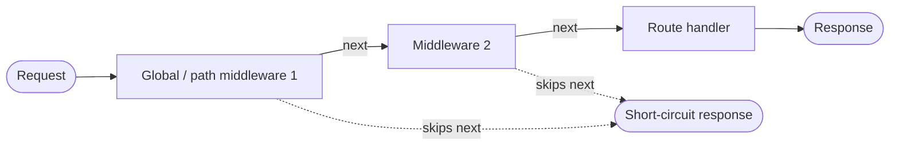

# Middleware

Middleware lets you run code before your route handler — logging, auth, CORS, body limits — without repeating it in every handler. SwiftNet uses an Express-style chain: each middleware receives the request, the response, and a `next` callback it can call to continue or skip to short-circuit.

## Quick start

```cpp
#include <swiftnet.hpp>
using namespace swiftnet;

int main() {
    SwiftNet app;

    // Global middleware: runs for every request, in registration order.
    app.use([](Request& req, Response& res, std::function<void()> next) {
        // do work before the handler...
        next(); // continue the chain (omit to short-circuit)
    });

    // Path-scoped middleware: only runs when the path starts with the prefix.
    app.use("/admin", [](Request& req, Response& res, std::function<void()> next) {
        if (req.header("Authorization").empty()) {
            res.status(401).text("unauthorized"); // do NOT call next()
            return;                               // short-circuit: handler is skipped
        }
        next();
    });

    app.get("/admin/users", [](Request& req, Response& res) {
        res.json(Json{{"users", Json::array()}});
    });

    app.listen([] {});
}
```

## How it works

- A middleware has the signature `void(Request&, Response&, std::function<void()> next)` — the alias `middleware_t` (`include/swiftnet.hpp`).
- Calling `next()` runs the next middleware in the chain; once the chain is exhausted, the route handler runs.
- **Not** calling `next()` short-circuits the request: nothing further runs, and whatever you wrote to the `Response` is sent. This is how an auth `401` or a CORS preflight reply ends the request early.
- For each request, SwiftNet builds the applicable chain in registration order: all global `use(mw)` middleware first, then every path-scoped `use(prefix, mw)` whose prefix matches the request path (`src/swiftnet.cpp`, `run_middlewares`).
- The chain is run by a shared curried-`next()` runner (`detail::run_chain`), so global and scoped chains behave identically.



> Path matching is a literal prefix check: `req.path()` must *start with* the registered prefix. `app.use("/admin", ...)` matches `/admin`, `/admin/users`, and also `/administrators`. Use a trailing-aware prefix if that matters to you.

## API variants

| Call | Signature | When it runs | Short-circuit by |
|------|-----------|--------------|------------------|
| `app.use(mw)` | `middleware_t` | Every request, after async middleware, before the handler | Not calling `next()` |
| `app.use(prefix, mw)` | `(const std::string&, middleware_t)` | Requests whose path starts with `prefix` | Not calling `next()` |
| `app.use_async(mw)` | `async_middleware_t` | Before routing (before route matching) | Calling `res.end()` (or otherwise ending the response) |

`middleware_t` is `std::function<void(Request&, Response&, std::function<void()>)>`. `async_middleware_t` is `std::function<vthread(Request&, Response&)>` — a coroutine, so it may `co_await` async I/O.

### Async middleware

`use_async` middleware runs **before routing** and can suspend on I/O. There is no `next` parameter; the runner advances automatically when your coroutine returns. To short-circuit, end the response yourself — calling `res.end()` (or any method that ends it, e.g. `res.status(...).send(...)`) sets the "ended" flag, and SwiftNet sends the response without routing (`src/swiftnet.cpp`, `handle_request_async`).

```cpp
app.use_async([](Request& req, Response& res) -> vthread {
    auto token = req.header("Authorization");
    bool ok = co_await verify_token_async(token); // suspends on I/O
    if (!ok) {
        res.status(401).end();  // short-circuit: routing is skipped
        co_return;
    }
    co_return; // fall through to routing + sync middleware + handler
});
```

## Execution order

Per request, SwiftNet runs:

1. **Async middleware** (`use_async`), in registration order — before any route matching.
2. **Route matching** against the compiled radix router.
3. **Sync chain** (`run_middlewares`): global `use(mw)` middleware, then matching path-scoped `use(prefix, mw)` middleware, all in registration order.
4. **The route handler**, only if the sync chain ran to the end (no one short-circuited).

> Convenience helpers register normal middleware under the hood: `app.cors(origin)` adds a global `use(...)` that sets CORS headers and replies to `OPTIONS` preflights directly (short-circuiting), and `app.logger()` / `app.json(limit)` register global middleware too.

## Scoped middleware and plugins

Plugins register **scoped** middleware: `use(mw)` inside a plugin applies only to routes registered in that scope (and its children). Scoped middleware is composed into the handler at registration time, so it adds no per-request lookup cost, and routes outside the scope are unaffected.

Global `app.use` middleware runs **outermost** — it wraps the scoped middleware, which in turn wraps the handler. See [Plugins](plugins.md) for how scopes, prefixes, and decorators compose.

## Common pitfalls

- **Forgetting `next()`.** In a sync middleware, if you don't call `next()` the handler never runs. This is intentional for auth/preflight, but an easy accident otherwise.
- **Calling `next()` after ending the response.** Decide early: short-circuit (write a response, return) *or* continue (`next()`), not both.
- **Expecting `next` in `use_async`.** Async middleware has no `next` parameter — it continues automatically on return and short-circuits only when the response is ended.
- **Prefix is a substring match from position 0.** `app.use("/admin", ...)` also matches `/administrators`. Pick prefixes deliberately.
- **Async middleware always runs first.** It executes before routing, so it runs even for requests that won't match any route. Keep it cheap or guard on `req.path()`.

## See also

- [Requests and responses](requests-and-responses.md)
- [Plugins](plugins.md)
- [Request lifecycle](../architecture/request-lifecycle.md)
