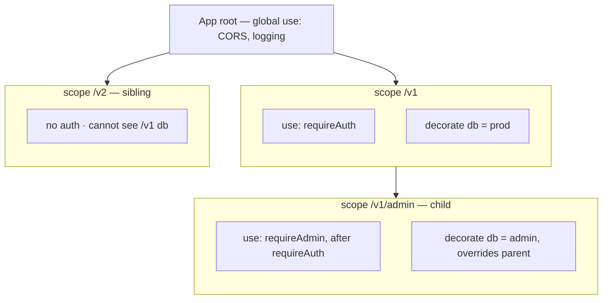

# Plugins & encapsulation

SwiftNet has a Fastify-style plugin system: you register a function that receives a `Scope`, and everything you do inside that scope — routes, middleware, and typed state — is *encapsulated* under a path prefix. Scoped middleware and decorators flow down to nested plugins but never leak to siblings, and all of it is composed at registration time so there is zero per-request overhead.

## Quick start

```cpp
#include <swiftnet.hpp>
#include <swiftnet/scope.hpp>

using namespace swiftnet;

int main()
{
    SwiftNet app;

    app.plugin([](Scope& v1)
    {
        // Scoped middleware: runs for /v1/* (and any nested scope), never for siblings.
        v1.use([](Request& req, Response& res, std::function<void()> next)
        {
            if (req.header("authorization").empty())
            {
                res.unauthorized().json(Json{{"error", "missing token"}});
                return; // skip next() to short-circuit
            }
            next();
        });

        // Typed scoped state, read back at registration and captured into the handler.
        v1.decorate<std::string>("region", "eu-west");
        auto region = v1.get<std::string>("region"); // std::shared_ptr<const std::string>

        v1.get("/whoami", [region](Request&, Response& res)
        {
            res.json(Json{{"region", *region}}); // -> GET /v1/whoami
        });

        // Nested plugin: inherits /v1's middleware + decorators, then overrides one.
        v1.plugin([](Scope& admin)
        {
            admin.decorate<std::string>("region", "admin-only"); // shadows parent
            auto region = admin.get<std::string>("region");

            admin.get("/region", [region](Request&, Response& res)
            {
                res.json(Json{{"region", *region}}); // -> GET /v1/admin/region
            });
        }, { .prefix = "/admin" });

    }, { .prefix = "/v1" });

    // Sibling scope: cannot see /v1's "region" decorator or its auth middleware.
    app.plugin([](Scope& v2)
    {
        auto region = v2.get<std::string>("region"); // nullptr: sibling isolation

        v2.get("/whoami", [region](Request&, Response& res)
        {
            res.json(Json{{"region", region ? *region : "unknown"}}); // -> "unknown"
        });
    }, { .prefix = "/v2" });

    app.listen([] { /* ready */ });
}
```

## How it works

- `app.plugin(fn, { .prefix = "/v1" })` constructs a `Scope` and hands it to your function `fn`. The `Scope` is a *transient, registration-time* object — it lives only for the duration of `fn`. (`SwiftNet::plugin`, `include/swiftnet.hpp` ~274; `PluginOpts` ~231.)
- **Scoped routes** are registered at `prefix + path`. A `v1.get("/users", ...)` inside a `/v1` scope becomes `GET /v1/users`. Paths are joined into a clean single-slash, no-trailing-slash form, so `"/v1"` + `"/users"` and `"/v1/"` + `"users"` both yield `/v1/users`.
- **Scoped middleware** registered with `v1.use(mw)` applies to every route on this scope and its descendants, in `root -> ... -> this` order. It never runs for sibling scopes or for the parent's other routes.
- **Typed decorators** attach state to a scope: `decorate<T>(key, value)` stores it, and `get<T>(key)` reads it back as a `std::shared_ptr<const T>`. The result is **read-only by design**, so a handler that captures a decorator cannot mutate state shared across engines.
- **Decorator resolution** walks own scope first, then parents (child shadows parent), and **stops at the first match** — siblings are never consulted. A missing key, or a key stored under a different type, returns `nullptr` (a safe miss, never UB); debug builds log it.
- **Nested plugins** (`scope.plugin(fn, { .prefix = "/admin" })`) create a child scope that inherits the parent's middleware chain and decorators, may add or override its own, and prefixes onto the parent path (`/v1` + `/admin` = `/v1/admin`).
- **Everything is composed at registration.** For each route, the scoped middleware chain is flattened and baked into a single `handler_t` that is stored in the same global router the rest of the app uses. The per-request hot path is unchanged, and a prefix-only plugin (no scoped middleware anywhere up the chain) registers the handler *directly* — byte-identical per-request cost to a hand-registered route. (`Scope::add`, `include/scope.hpp` ~135-159.)
- **Global `app.use` middleware still runs outermost.** App-level middleware wraps the composed scoped handler, so it executes before any scoped middleware. See [middleware.md](middleware.md) for the ordering rules.



> Encapsulation here is purely a registration-time arrangement. The `Scope` object and its decorator store do not exist at request time — only the composed handlers do. There is no per-request scope lookup, no shared mutable map, and no locking.

## The Scope API

All route verbs and `use`/`plugin` return `Scope&` for chaining. Confirmed against `include/scope.hpp`.

| Member | Signature | Notes |
| --- | --- | --- |
| `get`, `post`, `put`, `del`, `patch`, `options`, `head` | `Scope& verb(const std::string& path, F&& handler)` | Registers at `prefix + path`. `handler` is a sync `void(Request&,Response&)` or async `vthread(Request&,Response&)` coroutine — same as `SwiftNet`. |
| `use` | `Scope& use(middleware_t mw)` | Scoped middleware (this scope + descendants), `root -> ... -> this` order. |
| `plugin` | `Scope& plugin(Fn&& fn, PluginOpts opts = {})` | Nested child scope; inherits middleware + decorators. |
| `decorate<T>` | `Scope& decorate<T>(const std::string& key, T value)` | Stores typed state for this scope and its descendants. |
| `get<T>` | `std::shared_ptr<const T> get<T>(const std::string& key) const` | Own → parent resolution; `nullptr` on missing key or type mismatch. **Read-only.** |
| `prefix` | `const std::string& prefix() const noexcept` | The fully joined prefix for this scope. |

`middleware_t` is `std::function<void(Request&, Response&, std::function<void()> next)>` (Express-style: call `next()` to continue, skip it to short-circuit). `PluginOpts` has one field, `std::string prefix` — empty inherits the parent prefix unchanged.

## Inheritance, override, and isolation

Given the Quick start above, the three scopes resolve `"region"` independently:

| Route | Resolves `"region"` to | Why |
| --- | --- | --- |
| `GET /v1/whoami` | `"eu-west"` | Own decorator on the `/v1` scope. |
| `GET /v1/admin/region` | `"admin-only"` | Child decorator shadows the inherited `/v1` value. |
| `GET /v2/whoami` | `nullptr` → `"unknown"` | Sibling scope; `/v1`'s decorator is invisible. Lookup never walks siblings. |

The `/v1` auth middleware likewise guards `/v1/whoami` and `/v1/admin/region` (the nested scope inherits it) but does **not** guard `/v2/whoami`.

## Common pitfalls

- **`get<T>` requires the exact stored type.** `decorate<std::string>("region", ...)` then `get<std::string_view>("region")` returns `nullptr` (type mismatch), not the value. Match the type parameter exactly. Debug builds log the miss with the requested type name.
- **Decorators are read-only.** `get<T>` hands back `std::shared_ptr<const T>`; you cannot write through it. If you need per-request mutable data, use `Request`/`Response` state, not a decorator.
- **Read decorators at registration, not at request time.** Call `get<T>` inside the plugin function and capture the returned `shared_ptr` into your handler's lambda (the `shared_ptr` keeps the object alive after the transient `Scope` is gone). Do not keep a reference to the `Scope` itself — it does not outlive `fn`.
- **`required{}` is unrelated here.** Validation constraints live on schemas, not scopes; see [validation.md](validation.md).
- **Prefix-only plugins add no middleware.** If a scope (and its parents) declare no `use(...)`, routes are registered directly with no wrapper. That is intended — you only pay for scoped middleware when you actually add some.
- **Global middleware order.** `app.use(...)` always wraps scoped handlers from the outside; do not rely on scoped middleware running before global middleware.

## See also

- [Routing](routing.md) — the route verbs and path matching that scopes register into.
- [Middleware](middleware.md) — `use`, `use_async`, ordering, and the `next()` contract.
- [Validation](validation.md) — typed `body<T>()`, `validate<T>`, and `bind<T>`.
- [Architecture overview](../architecture/overview.md) — per-engine model and the no-shared-mutable-state guarantee that motivates read-only decorators.
